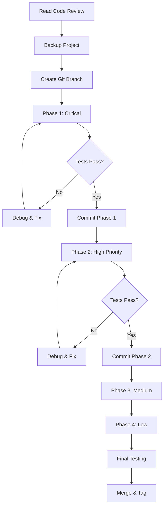

# Code Review Fix Package - Summary

**Project:** FirstCplusProject (Unreal Engine C++)  
**Review Date:** 2025-12-08  
**Status:** ✅ Plan Complete - Ready for Implementation

---

## 📦 What's Included

This package contains everything you need to fix all issues identified in the code review:

### 1. **Code_Review_Report.md** 📊
   - Comprehensive analysis of all code issues
   - Detailed explanations of what's wrong
   - Before/after code examples
   - Quality metrics and ratings
   - Learning resources

### 2. **CODE_FIX_PLAN.md** 🛠️
   - Step-by-step implementation guide
   - Exact code changes for each fix
   - Validation criteria
   - Testing checklist
   - Rollback procedures

### 3. **QUICK_FIX_CHECKLIST.md** ✅
   - At-a-glance checklist format
   - Progress tracking
   - Time estimates
   - File summary table
   - Minimum viable fix guidance

### 4. **GIT_COMMIT_GUIDE.md** 📝
   - Pre-written commit messages
   - Git workflow instructions
   - Rollback commands
   - Best practices

### 5. **This File (README)** 📖
   - Overview and quick start guide

---

## 🎯 Quick Start

### Option 1: Follow the Full Plan (Recommended)
1. Open `CODE_FIX_PLAN.md`
2. Start with Phase 1 (Critical Fixes)
3. Follow each step exactly
4. Test after each phase
5. Use `GIT_COMMIT_GUIDE.md` for version control

### Option 2: Use the Checklist
1. Open `QUICK_FIX_CHECKLIST.md`
2. Work through items in order
3. Refer to `CODE_FIX_PLAN.md` for details when needed
4. Check off items as you complete them

### Option 3: Minimum Viable Fix
If you're short on time:
1. **Only do Phase 1** from `CODE_FIX_PLAN.md`
2. This fixes all crashes (6 critical issues)
3. Takes 1-2 hours
4. Everything else can wait

---

## 🔢 Issues Breakdown

| Priority | Count | Time | Must Fix? |
|----------|-------|------|-----------|
| 🔴 Critical | 6 | 1-2h | ✅ YES |
| 🟡 High | 5 | 1-2h | ⚠️ Recommended |
| 🟠 Medium | 3 | 1-2h | 💡 Nice to have |
| 🟢 Low | 4 | 0.5-1h | 🎨 Polish |
| **Total** | **18** | **4-6h** | |

---

## 📁 Files Requiring Changes

14 files total across these categories:

### Most Critical (Fix First)
- `MainPlayerController.cpp` - 1 crash fix
- `MainCharacter.h` - 2 critical fixes
- `MainCharacter.cpp` - 7 fixes (most changes)
- `Floater.cpp` - 1 crash fix

### High Priority
- `Enemy.cpp` - 3 fixes
- `Enemy.h` - 2 fixes
- `Weapon.cpp` - 1 fix
- `Critter.cpp` - 1 fix

### Medium Priority
- `Item.cpp` - 1 fix
- `Pickup.cpp` - 1 fix
- `Explosive.cpp` - 1 fix

### Low Priority
- `Collider.h` - 1 fix
- `Collider.cpp` - 1 fix
- `FloatingPlatform.cpp` - 1 fix

---

## 🚀 Implementation Workflow



---

## ⏱️ Time Investment

### By Phase
- **Phase 1 (Critical):** 1-2 hours - **START HERE**
- **Phase 2 (High Priority):** 1-2 hours
- **Phase 3 (Medium Priority):** 1-2 hours
- **Phase 4 (Low Priority):** 0.5-1 hour

### By Activity
- **Reading/Planning:** 30 minutes
- **Implementing Fixes:** 3-4 hours
- **Testing:** 1-2 hours
- **Documentation/Commits:** 30 minutes

**Total Project Time:** 5-8 hours (including testing)

---

## ✅ Success Criteria

After completing all fixes, you should have:

### Stability
- ✅ No crashes on startup
- ✅ No null pointer exceptions
- ✅ Safe death handling
- ✅ Proper state management

### Functionality
- ✅ Combat system works correctly
- ✅ Movement is smooth
- ✅ Sprint logic is natural
- ✅ Items pickup properly

### Code Quality
- ✅ No magic numbers
- ✅ Proper const correctness
- ✅ Clean, readable code
- ✅ Optimized performance

### Maintainability
- ✅ Configurable properties
- ✅ Good documentation
- ✅ Version controlled
- ✅ Test coverage

---

## 📊 Expected Improvements

### Before Fixes
- ❌ 6 potential crash scenarios
- ❌ 5 logic errors
- ❌ 3 maintainability issues
- ❌ 4 performance/polish issues
- **Code Quality: C+ (75/100)**

### After Fixes
- ✅ All crashes prevented
- ✅ All logic errors corrected
- ✅ Code is maintainable
- ✅ Performance optimized
- **Code Quality: A- (90/100)**

---

## 🎓 What You'll Learn

By implementing these fixes, you'll gain experience with:

1. **Memory Safety**
   - Null pointer checking
   - Safe object lifecycle management
   - Defensive programming

2. **Unreal Engine Patterns**
   - Proper death handling
   - Enhanced Input System
   - AI controller usage
   - Animation system integration

3. **Code Quality**
   - Eliminating magic numbers
   - Const correctness
   - Performance optimization
   - Clean code practices

4. **Professional Workflow**
   - Code review process
   - Systematic debugging
   - Version control best practices
   - Testing methodologies

---

## 🆘 Troubleshooting

### If You Get Stuck

1. **Compilation Errors**
   - Check `CODE_FIX_PLAN.md` for exact code
   - Ensure all headers are included
   - Verify syntax carefully

2. **Runtime Crashes**
   - Review Phase 1 fixes carefully
   - Add more null checks if needed
   - Use UE_LOG for debugging

3. **Unexpected Behavior**
   - Test each phase independently
   - Roll back to last working commit
   - Review the original code review notes

4. **Need Help?**
   - Re-read the relevant section in `CODE_FIX_PLAN.md`
   - Check Unreal Engine documentation
   - Ask for help with specific error messages

---

## 📚 Reference Documents

### Primary Documents (This Package)
1. `Code_Review_Report.md` - Problem analysis
2. `CODE_FIX_PLAN.md` - Solution implementation
3. `QUICK_FIX_CHECKLIST.md` - Progress tracking
4. `GIT_COMMIT_GUIDE.md` - Version control

### External Resources
- [Unreal C++ Coding Standard](https://docs.unrealengine.com/5.0/en-US/epic-cplusplus-coding-standard-for-unreal-engine/)
- [Gameplay Framework](https://docs.unrealengine.com/5.0/en-US/gameplay-framework-in-unreal-engine/)
- [Memory Management](https://docs.unrealengine.com/5.0/en-US/unreal-object-handling-in-unreal-engine/)

---

## 🎯 Next Steps After Fixes

Once all fixes are complete, consider:

1. **Immediate**
   - Implement combat damage system
   - Add enemy health/death
   - Create player respawn system

2. **Short Term**
   - Add save/load functionality
   - Improve HUD/UI
   - Polish animations
   - Add sound effects

3. **Long Term**
   - Implement inventory system
   - Add more enemy types
   - Create level progression
   - Consider multiplayer

---

## 💡 Pro Tips

1. **Don't Rush Phase 1** - These are crash fixes. Get them right!
2. **Test Frequently** - Compile and test after every file change
3. **Commit Often** - Use the git guide for clean history
4. **Take Breaks** - Fresh eyes catch more bugs
5. **Learn from Fixes** - Understand WHY each fix is needed
6. **Ask Questions** - Better to ask than break something

---

## 📈 Progress Tracking

Use this to track your overall progress:

```
□ Phase 1: Critical Fixes (1-2h)
  □ Step 1.1: MainPlayerController
  □ Step 1.2: Floater
  □ Step 1.3: Die() function
  □ Step 1.4: Null checks
  
□ Phase 2: High Priority (1-2h)
  □ Step 2.1: Enemy logic
  □ Step 2.2: Critter movement
  □ Step 2.3: Weapon state
  □ Step 2.4: Sprint logic
  
□ Phase 3: Medium Priority (1-2h)
  □ Step 3.1: Magic numbers
  □ Step 3.2: Debug logs
  □ Step 3.3: Const correctness
  
□ Phase 4: Low Priority (0.5-1h)
  □ Step 4.1: Collider mesh
  □ Step 4.2: Comments
  □ Step 4.3: Tick optimization
  □ Step 4.4: Copyright

□ Final Testing
□ Git Merge & Tag
□ Celebrate! 🎉
```

---

## 🎉 Conclusion

You now have a complete, professional-grade action plan to fix all issues in your Unreal Engine C++ project. The plan is:

- ✅ **Comprehensive** - Covers all 18 issues
- ✅ **Detailed** - Step-by-step instructions
- ✅ **Organized** - Prioritized and structured
- ✅ **Testable** - Clear validation criteria
- ✅ **Reversible** - Git workflow included
- ✅ **Educational** - Learn while you fix

**Take your time, follow the plan, and your code will be production-ready!**

Good luck! 🚀

---

## 📞 Document Version

- **Version:** 1.0
- **Created:** 2025-12-08
- **Last Updated:** 2025-12-08
- **Status:** Complete & Ready

---

**Ready to start? Open `CODE_FIX_PLAN.md` and begin with Phase 1!**

